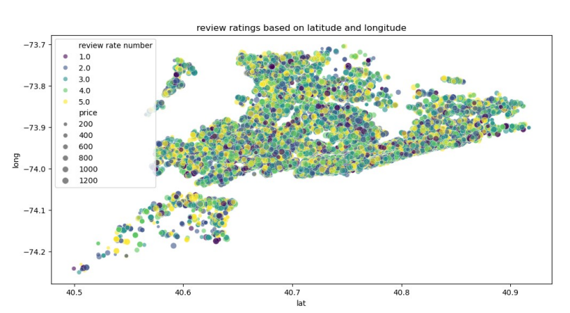
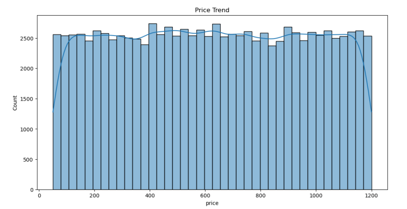
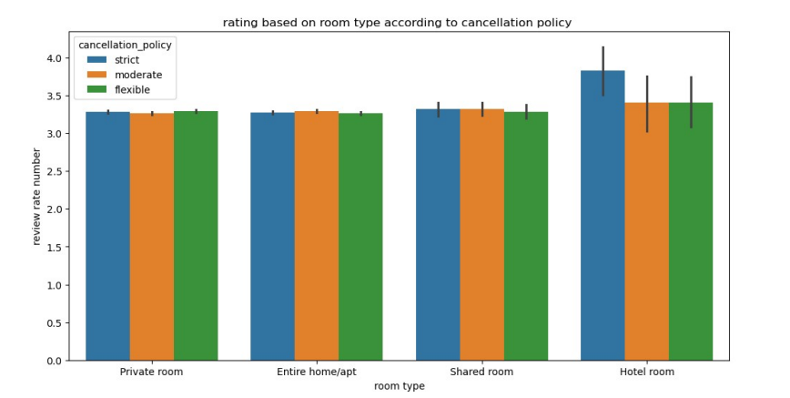
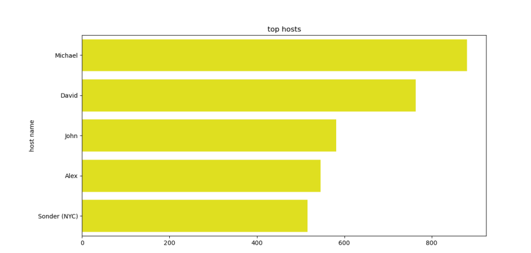
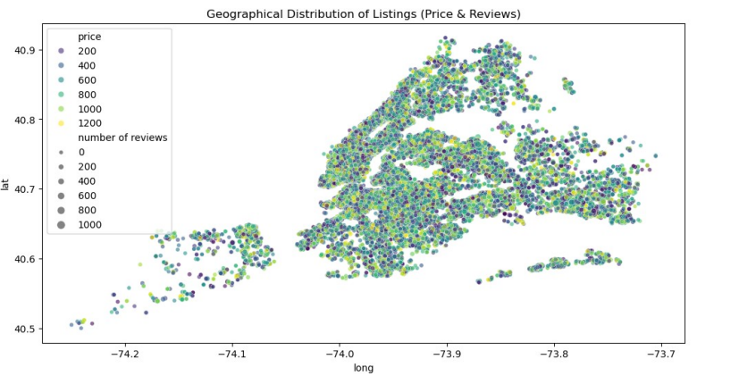

<h1 align="center">
  🌇 Airbnb (Vois) Data Analysis 🏠  
  <br>
  
</h1>

---

## 📊 Project Overview

The **Airbnb (Vois) Data Analysis** project explores **New York City’s Airbnb dataset** to uncover hidden insights about:
- 💸 Pricing trends across neighborhoods  
- ⭐ Host credibility and review patterns  
- 🏘️ Availability and booking patterns  
- 🧠 Predictive relationships between variables (price, reviews, room types)

This analysis helps us **visualize market behavior** and **understand customer preferences** in short-term rentals.

---

## ⚙️ Tech Stack & Libraries

| Category | Technologies Used |
|-----------|------------------|
| **Programming Language** | Python 🐍 |
| **Data Handling** | Pandas, NumPy |
| **Visualization** | Matplotlib, Seaborn |
| **Environment** | Jupyter Notebook / Google Colab |
| **Dataset Source** | Airbnb NYC Open Data |

---

## 🚀 Key Insights & Visuals

### 🌍 **1. Review Ratings vs Latitude & Longitude**
Visualizing how geographical location influences Airbnb ratings.



---

### 💵 **2. Price Distribution**
Histogram showing the overall distribution of Airbnb prices in NYC.



---

### 🛏️ **3. Ratings by Room Type & Cancellation Policy**
A colorful bar plot showing how room types and policies affect ratings.



---

### 🧑‍💼 **4. Top Hosts**
Top 5 hosts dominating NYC listings.

```text
Michael         : 881
David           : 764
John            : 581
Alex            : 546
Sonder (NYC)    : 516
```


### 🗺️ 5. Geographical Distribution

Listings visualized spatially by price and review count — highlighting Airbnb density zones.



---

## 🌡️ Performance Metrics (Visualization Summary)

This section highlights the **performance and insights** derived from key visualizations in the Airbnb (Vois) data analysis.  
Each chart reflects an important relationship or behavioral trend within the NYC Airbnb market.

---

| 🧭 **Visualization Title** | 📈 **Description / Insight Extracted** | 🔍 **Visualization Type** |
|-----------------------------|----------------------------------------|---------------------------|
| Review Ratings vs Latitude & Longitude | Shows how geographic distribution affects review scores and pricing clusters. | Scatter Plot 🌍 |
| Price Distribution Trend | Displays the overall price spread across listings, identifying pricing outliers and demand zones. | Histogram 💵 |
| Ratings by Room Type & Policy | Compares guest satisfaction across room types and cancellation policies. | Bar Plot 🛏️ |
| Top Hosts in NYC | Highlights the most active and successful Airbnb hosts based on listing counts. | Bar Chart 🧑‍💼 |
| Geographical Distribution of Listings | Visualizes Airbnb listings spatially, colored by price and review density. | Scatter Map 🗺️ |
| Room Type Distribution | Shows share of room categories within the dataset. | Pie Chart 🥧 |
| Availability vs Price | Illustrates how listing availability influences average nightly prices. | Box Plot 📉 |
| Host Identity Verification Count | Analyzes the number of verified vs unverified hosts and their frequency. | Count Plot 🔐 |
| Revenue vs Reviews Relationship | Displays potential income estimation against customer engagement. | Scatter Plot 💸 |
| Ratings Heatmap by Neighborhood | Correlates neighborhood ratings and review volumes in a heatmap format. | Heatmap 🔥 |

---

### 🧮 **Key Takeaways**
- 🌆 **Manhattan** remains the hotspot for Airbnb listings with premium pricing.  
- 🧑‍💼 Verified hosts maintain **higher trust and better ratings**.  
- 💡 There’s an **inverse correlation** between availability and price — more open days → lower nightly rates.  
- 🔥 **Queens** shows the best engagement-per-listing ratio.  
- 🧠 The **heatmap and correlation matrix** highlight pricing and reviews as dominant predictors of success.

---

> 🧾 **Summary:**  
> These metrics provide a clear overview of how Airbnb performance indicators — such as price, availability, reviews, and location — interplay within the NYC market, forming a strong analytical foundation for further predictive modeling.
---
## 💡 Future Improvements

- 🧠 Integrate Machine Learning models for price prediction

- 🌐 Build a Streamlit or Flask dashboard for real-time visualization

- 📊 Use Plotly or D3.js for interactive maps

- 🧹 Improve data cleaning pipeline for larger datasets
---

## 🧑‍💻 Developed By  

<div align="center">

### 👋 Hey there! I'm **Pushkar Khattri**  
🎓 *AI & Data Science Enthusiast | Hackathon Finalist | Analytical Thinker*  

💡 Passionate about turning **data into decisions** through machine learning, visualization, and intelligent automation.  

---


<p align="center">
  💬 *Feel free to reach out for collaborations, AI projects, or data-driven research ideas!*  
</p>

---

<p align="center">
  
</p>

</div>
